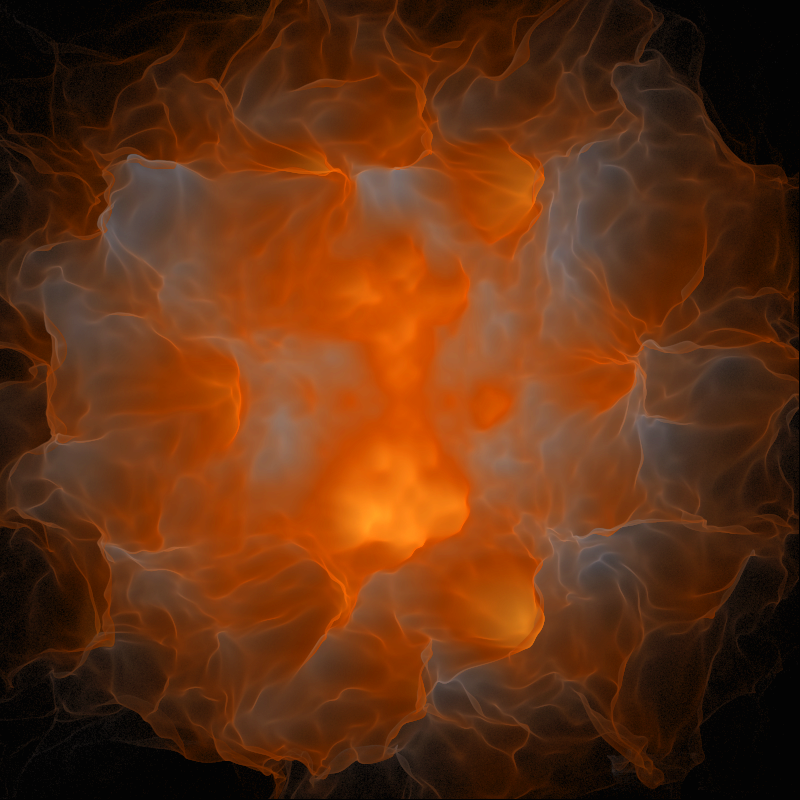

# ldensity-render-article

Log density rendering code for Processing

## List of scripts

Progressively built solution, each step has it's own separate script

* Native rendering
* Linear density rendering
* Linear density rendering with gamma correction
* Log density rendering with gamma correction
* Log density rendering with colors
* Log density rendering with vibrant colors and brightness/contrast/saturation adjustments
* Log density rendering with reconstruction filters
* Multithreaded log density rendering - final solution

## Reconstruction filter visualization

Play with reconstruction filters parameters
Script: filter_vis

Press to show:
0 - Gaussian filter
1 - Windowed Sinc filter
2 - Blackman-Harris filter
3 - Triangle filter
4 - Hann filter